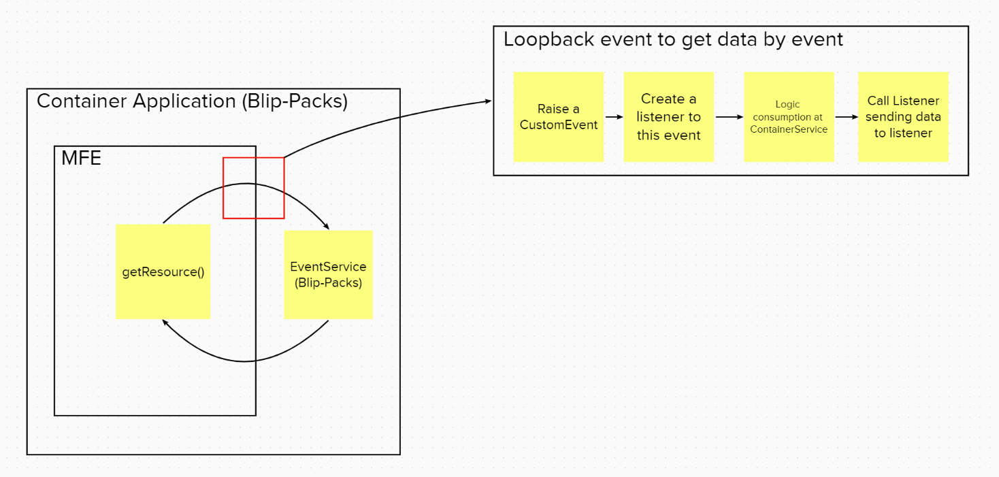

# Introduction

This project is a Micro Frontend Template to implement configuration plugins over the Self-onboarding process for Blip Packs.

# Project Stack

-   **Main Library**: React;
-   **Language**: Typescript;
-   **Micro front-end strategy**: Web Components
-   **Commit hooks**: Husky

# Development and Usage

1. Clone this repo;
2. Change the `APPLICATION_NAME` value at `constants/Application.ts` file. (Example: `tenant-mfe`);
3. `npm install && npm start`

# Principles

After finishing the layout implementation, this plugin will need to communicate with the Self-onboarding in order to save inputted data from the user.
This communication uses the [EventAPI](https://developer.mozilla.org/pt-BR/docs/Web/API/Event) to implement a PubSub communication.



This communication is already implemented on this template. Under `services/SelfOnboarding.ts`, you'll find three core methods to persist the user data:

```
getResource(resourceName: string)
setResources(resourceName: string, value: string)
sendCommand(commandName: Command, payload: any)
```

Development is still being made, and any inconsistences should be reported to Merchant Experience (MEX) team.

# Tests

Use the suffix `*.spec.ts` when writing unit test suites and `*.test.ts` when writing integration tests. Doing this, you'll be able to run then with separate scripts, such as:

-   `npm run test:unit` -> for unit tests
-   `npm run test:unit` -> for integration tests
-   `npm run test:verbose` -> for all tests, not suppressing logs
-   `npm run test:coverage` -> for all tests, with coverage report (available on **/coverage/Icov-report/index.html**)
